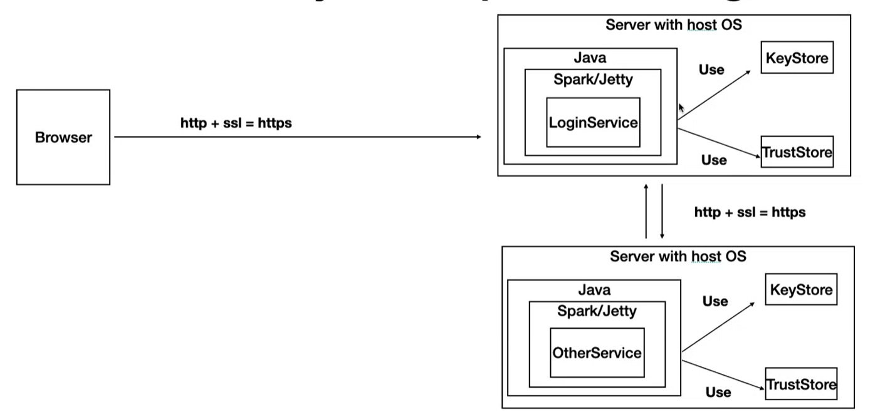

# LABORATORY - SAFE DISTRIBUTED APPLICATION ON ALL YOUR FRONTS. 🚀

## Escuela Colombiana de Ingeniería - Enterprise Architectures(AREP).

_In this laboratory we are going to allow secure access from the browser to our application, thus guaranteeing the authentication, authorization and integrity of the users. Making use of two computers which communicate with each other, where the access of the remote services complies with the guarantee of: authentication, authorization and integrity between the services._

## Getting Started

### Prerequisites

- [Maven](https://maven.apache.org/) - Dependency Management.

- [Java 8](https://www.oracle.com/co/java/technologies/javase/javase-jdk8-downloads.html) -  Development Environment.

- [Git](https://git-scm.com/) - Version Control System.

- [Spark](http://sparkjava.com/) - Micro framework for creating web applications in Java 8.


Make sure you have this programs installed correctly and the version that we need with the following commands:

```
mvn --version
```

```
git --version
```

```
java -showversion
```

### Installing

1. Clone the repository:

```
git clone https://github.com/angiedanielar/LAB6_AREP.git
```

2. Compile the projet:

[In this directory](https://github.com/angiedanielar/LAB6_AREP/Service) and [In this directory](https://github.com/angiedanielar/LAB6_AREP/Login)


```
mvn package
```

3. Executing the LOGIN program:

[In this directory](https://github.com/angiedanielar/LAB6_AREP/Login)

```
mvn exec:java -D "exec.mainClass"="edu.escuelaing.arep.SparkWebApp"

And put in your browser: https://localhost:5000
```

- Email: daniela@gmail.com
- Password: hola123

4. Executing the SERVICE program:

[In this directory](https://github.com/angiedanielar/LAB6_AREP/Service)

```
mvn exec:java -D "exec.mainClass"="edu.escuelaing.arep.SparkWebApp"
```

5. Generating the documentation:

[In this directory](https://github.com/angiedanielar/LAB6_AREP/Service) and [In this directory](https://github.com/angiedanielar/LAB6_AREP/Login)

```
mvn javadoc:javadoc
```

## Architecture



## Built With

- [Maven](https://maven.apache.org/) - Dependency Management

- [Java 8](https://www.oracle.com/co/java/technologies/javase/javase-jdk8-downloads.html) -  Development Environment.

- [Git](https://git-scm.com/) - Version Control System.

- [Spark](http://sparkjava.com/) - Micro framework for creating web applications in Java 8.

- [Latex](overleaf.com) - Text composition system.

## Author

- Angie Daniela Ruiz Alfonso.

## License

This project is under GNU General Public License - see the [LICENSE](LICENSE) file for details.
